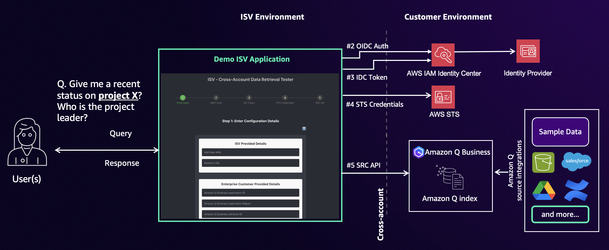

# Cross-Account Data Retrieval Tester for Amazon Q index

## Overview

[Amazon Q index for ISVs](https://aws.amazon.com/q/software-provider/) is a capability that enables ISVs to access customers' enterprise data through Amazon Q Index to enhance their SaaS solutions with generative AI experiences. The service enables ISVs to utilize customers' Retrieval Augmented Generation (RAG) data in a novel approach compared to traditional connector-based data source integration. The service includes key features such as multi-tenancy isolation within the Amazon Q Index and direct API access through [Search Relevant Content API](https://docs.aws.amazon.com/amazonq/latest/qbusiness-ug/isv-calling-api-idc.html) for headless Amazon Q Business implementation. These capabilities support authenticated user experiences and enable ISVs to enrich their own generative AI applications and enhance end-user experiences.

How does an ISV’s access to customers’ Amazon Q index data work? The process involves three simple steps: 

1.	The ISV registers with AWS a data accessor.
2.	The customer adds that ISV as a data accessor to enable access to their index.
3.	The ISV can then query the customer’s index through cross-account Search Relevant Content API requests. 

Provided sample solution demonstrates cross-account data retrieval functionality for Amazon Q index using AWS IAM Identity Center (IDC) authentication setup on Amazon Q Business. The application implements a step-by-step process for user authentication, token generation, obatain temporary credential and data retrieval through Search Content Retrieval API.

## Available Samples

#### [Sample ISV Webpage](/solutions/deployable-page) 
- Deployable sample ISV webpage that teaches each steps for Authorization Code authentication flow to access Q index with SearchRelevantContent API

#### [Shell script](/solutions/shell) 
- Shell script that goes through Authorization Code authentication flow to access Q index with SearchRelevantContent API

#### Lambda function 
- coming soon

#### [MCP Server](https://github.com/awslabs/mcp/tree/main/src/amazon-qindex-mcp-server)
- The AWS Labs amazon-qindex MCP Server is a Model Context Protocol (MCP) server designed to facilitate integration with Amazon Q Business's SearchRelevantContent API. While the server provides essential tools and functions for authentication and search capabilities using Amazon Q index, it currently serves for Independent Software Vendors (ISVs) who are AWS registered data accessors. The server enables cross-account search capabilities, allowing ISVs who are data accessors to search through enterprise customers' Q index and access relevant content across their data sources using specific authentication and authorization flows.

# Authors

- [Takeshi Kobayashi](https://www.linkedin.com/in/takeshikobayashi/)
- [Siddhant Gupta](https://www.linkedin.com/in/siddhant-gupta-a43a7b53/)
- [Akhilesh Amara](https://www.linkedin.com/in/akhilesh-amara/)

# License

This library is licensed under the MIT-0 License. See the LICENSE file.

- [Changelog](CHANGELOG.md) of the project.
- [License](LICENSE) of the project.
- [Code of Conduct](CODE_OF_CONDUCT.md) of the project.

## Using This In Production

It is critical that before you use any of this code in Production that you work with your own internal Security and Governance teams to get the appropriate Code and AppSec reviews for your organization. 

Although the code has been written with best practices in mind, your own company may require different ones, or have additional rules and restrictions.

You take full ownership and responsibility for the code running in your environment, and are free to make whatever changes you need to.