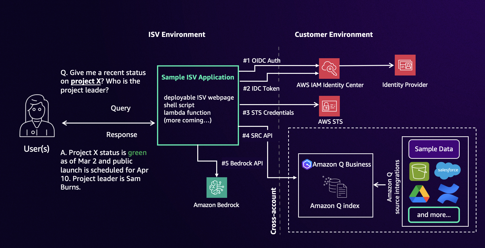

# Cross-Account Data Retrieval Tester for Amazon Q index

## Overview

This CDK application demonstrates cross-account data retrieval functionality for Amazon Q index using AWS IAM Identity Center (IDC) authentication setup on Amazon Q Business. The application implements a step-by-step process for authentication, token generation, and data retrieval through Search Content Retrieval API.



## Features

- CDK deploys Cross-Account Data Retrieval Tester application in ISV environment which helps demonstrate the user authentication, token generation and credential retrieval to make Search Content Retrieval API call.
- [optional] CDK helps deploy Amazon Q Business with assigned IAM IDC instance you prepared and ingests a sample data to test with. This step is not required with you have Amazon Q Business application already running with IAM IDC as access management.

## Prerequisites

- Node (v18) and NPM (v8.19) installed and configured on your computer
- AWS CLI (v2) installed and configured on your computer
- AWS CDK (v2) installed and configured on your computer (if running CDK to deploy Amazon Q Business)

- Two AWS Accounts (one account as ISV, another account acting as enterprise customer)
- Data accessor registered for your ISV and https://localhost:8081 registered as redirect URL ([see details on the process](https://docs.aws.amazon.com/amazonq/latest/qbusiness-ug/isv-info-to-provide.html))
- IAM Identity Center (IDC) instance setup with user added on enterprise customer AWS account
- Amazon Q Business application setup with IAM IDC as access management on enterprise customer AWS account [optional - CDK deployment for easy setup]
- Docker installed (for deploying CDK only; used for packaging python libraries to Lambda function)

## Key Components

The key component of this solution is to show the user authentication flow step-by-step (OIDC authentication with AWS IAM Identity Center, Token generation and management, STS credential handling) required to make Amazon Q Business's [SearchRelevantContent API](https://docs.aws.amazon.com/amazonq/latest/api-reference/API_SearchRelevantContent.html) requests to cross-account Q index on customer's environment.


This flow illustrates user authentication process in order for ISV application to make SearchRelevantContent API to access customer's Q index that this frontend solution demonstrates in steps.

## Deployment Steps

### Frontend deployment 

These instructions assume you have completed all the prerequisites.

1. Clone the solution to your computer (using `git clone`)

2. Set AWS credentials
    - In your terminal, navigate to `cross-account-qindex-demo/frontend`
    - Create .env.local file by `vi .env.local` and enter environment variables in the following format
    ```
REACT_APP_AWS_ACCESS_KEY_ID=<<replace with your AWS_ACCESS_KEY_ID>>
REACT_APP_AWS_SECRET_ACCESS_KEY=<<replace with your AWS_SECRET_ACCESS_KEY>>
REACT_APP_AWS_SESSION_TOKEN=<<replace with your AWS_SESSION_TOKEN>>
    ```

3. Deploy and run the frontend in your local host
    - In your terminal, navigate to `cross-account-qindex-demo/frontend`
    - Run `npm run install`
    - Run `npm start` which will run the server in https://localhost:8081

### Amazon Q Business deployment (CDK)

```
cdk deploy EnterpriseStack --parameters IdentityCenterInstanceArn=<<insert your IDC instance ARN>>
```