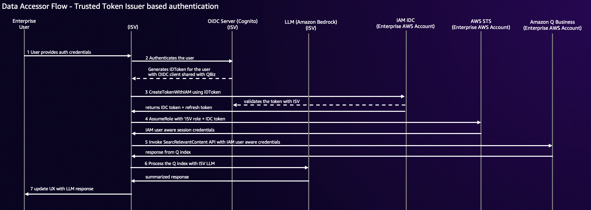

## ISV Data accessor Application

## Name
ISV Data Accessor for Q Index

## Description
This lightweight streamlit application demonstrates how a ISV as a data accessor can connect to a enterprise customers Q Index

## Prerequisites
- Python 3.10 or later
- Steamlit application needs to run on https://localhost:8081
- Dependencies found in requirements.txt installed
- Two AWS Accounts (one account as ISV running this tester application, another account acting as enterprise customer running Amazon Q Business)
- Data accessor registered for your ISV and make sure to add https://localhost:8081 as one of the redirect URLs ([see details from this related blogpost - Enhance enterprise productivity for your LLM solution by becoming an Amazon Q Business data accessor](https://aws.amazon.com/blogs/machine-learning/enhance-enterprise-productivity-for-your-llm-solution-by-becoming-an-amazon-q-business-data-accessor/))
- IAM Identity Center (IDC) instance setup with user added on enterprise customer AWS account
- Amazon Q Business application setup with IAM IDC as access management on enterprise customer AWS account 
- preferred model anthropic.claude-3-5-sonnet-20240620-v1:0 enabled in Bedrock
- Cognito with user pool and user(s)

In order to use this application, you will first need to have created the required ISV role in your ISV account. Secondly a data accessor will need to be
created by the service team and registered. Thirdly, in a seperate account where you have a Q Business instance, this account will need to be 
allow listed so that the data accessor is displayed in the Q Business console for testing.
See https://docs.aws.amazon.com/amazonq/latest/qbusiness-ug/isv.html for ISV information

See https://t.corp.amazon.com/create/templates/7b562ce3-e770-4d45-8a76-0c73eaca7eff for new data accessor SIM request.


## Installation
Clone this project, and install the dependencies found in the requirements.txt file.

## Setup Enviornment values
See .env file for required properties

For Auth flow you will need 

```
# ISV API account Access Keys
AWS_ACCESS_KEY_ID=
AWS_SECRET_ACCESS_KEY=


# ISV Q Index Role and Auth Code Redirect endpoint
ISV_ROLE_ARN=
REDIRECT_URI=

# Enterprise Q index and IAM IDC details
APPLICATION_ID=
RETRIEVER_ID=
APPLICATION_REGION=
IDC_APPLICATION_ARN=
IDC_REGION=


# If using TTI you will need the following additional properties
ISV_TENANT_ID=
ISV_COGNITO_USER_POOL_ID=
ISV_COGNITO_CLIENT_ID=
ISV_COGNITO_CLIENT_SECRET=
ISV_COGNITO_REGION=
```


## Instructions
The application contains a help page with instructions on usage. Depending on how the data accessor is setup, it can use the Auth flow or a TTI that is owned
by the ISV for authentication. Both methods are supported within the application. If the REDIRECT_URI in the .env file contains a value, then the application
will render the Auth flow button. If value is absent, then the application will render the TTI login button. In addtion to the authentication flow, the application 
also has a dashboard with a simple set of tests that can be ran. This will validate your ISV credentials and validate the role created within the ISV account.

If using TTI, the application is coded to use Cognito. You will need to create a user pool in Cognito, which is owned by your ISV account and populate the appropriate parameters in the .env file.


## TTI Flow


## Auth Flow


## Usage
To run application execute "streamlit run index.py"


## Clean Up
To remove the solution from your account, please follow these steps:

1. Remove data accessor
    - Go to the AWS Management Console, navigate to Amazon Q Business >  Data accessors
    - Select your data accessor and click 'Delete'
